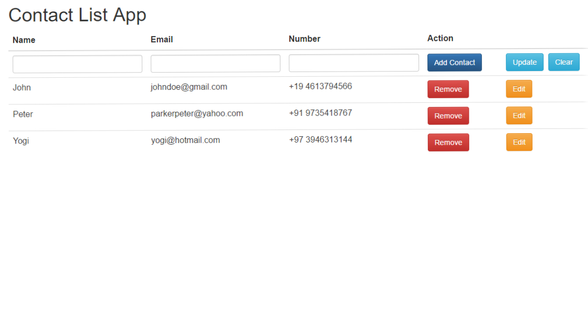

<h2>MEAN Stack RESTful API Tutorial - Contact List App</h2>

This repo contains the code for a RESTful API Contact List App that was built using the MEAN stack:

<ul>
	<li>MongoDB</li>
	<li>Express</li>
	<li>AngularJS</li>
	<li>NodeJS</li>
</ul>

<h2>Instructions</h2>

install the Node modules with

    npm install

then make sure MongoDB is running with

    mongod

and then run the code with 

    node server

open in your browser 

    localhost:3000
    
<h4>Issues Yet to be Resolved </h4>

<ul>
<li>The contact which is being updated, can also be added as "New contact"</li>
<li>There is no validations of emails and phone numbers yet</li>
<li>No confirmation before deleting a contact.</li>
</ul>
